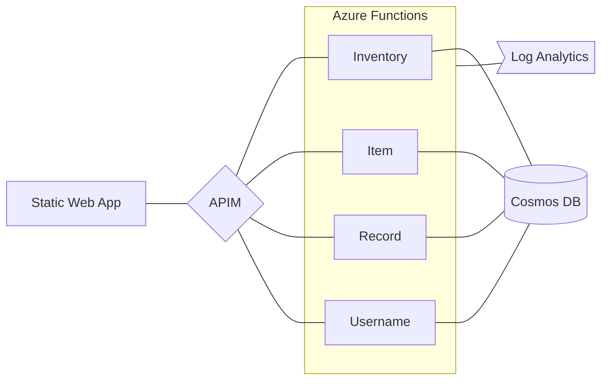

# Cloud Schema

See the [API documentation](api-doc.md) for more detailed information.

| Inventory       | Item        | Record      | Username      |
| --------------- | ----------- | ----------- | ------------- |
| get inventories | get items   | post record | get usernames |
| post inventory  | post item   | get records | post username |
|                 | delete item |             |               |
|                 | update item |             |               |
