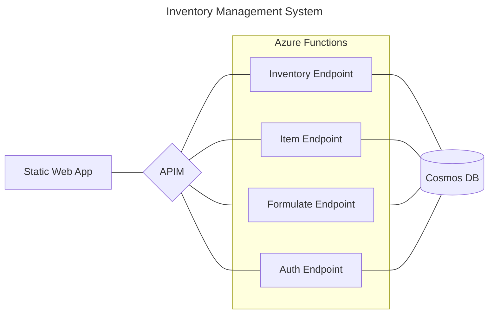

### Inventory Endpoint
 - get inventory logs
 - get inventory records
 - get inventory items
### Item Endpoint
 - post item
 - update item
 - delete item
### Formulate Endpoint
 - post record of item usage
### Auth Endpoint
 - get users

Extras/TODO:  Audit log, storage queue

