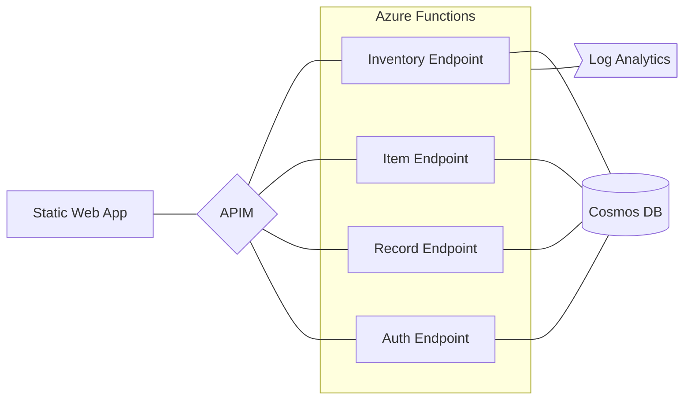

# Inventory Management System

See the [API documentation](api-doc.md) for more detailed information.

| Inventory  | Item        | Record      | Auth          |
| -          | -           | -           | -             |
| get logs   | post item   | get records | get usernames | 
| get items  | update item | post record | post username | 
|            | delete item |             |               | 