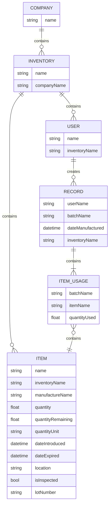

# Database Schema

```mermaid
erDiagram
    COMPANY ||--o{ INVENTORY : contains
    COMPANY {
        string name
    }
    INVENTORY ||--o{ ITEM : contains
    INVENTORY ||--o{ USER : contains
    INVENTORY {
        string name
        string companyName
    }
    USER ||--o{ RECORD : creates
    USER {
        string name
        string inventoryName
    }
    RECORD ||--|{ ITEM_USAGE : contains
    RECORD {
        string userName
        string batchName
        datetime dateManufactured
        string inventoryName
    }
    ITEM_USAGE }o--|| ITEM : contains
    ITEM_USAGE {
        string batchName
        string itemName
        float quantityUsed
    }
    ITEM {
        string name
        string inventoryName
        string manufactureName
        float quantity
        float quantityRemaining
        string quantityUnit
        datetime dateIntroduced
        datetime dateExpired
        string location
        bool isInspected
        string lotNumber
    }
```
